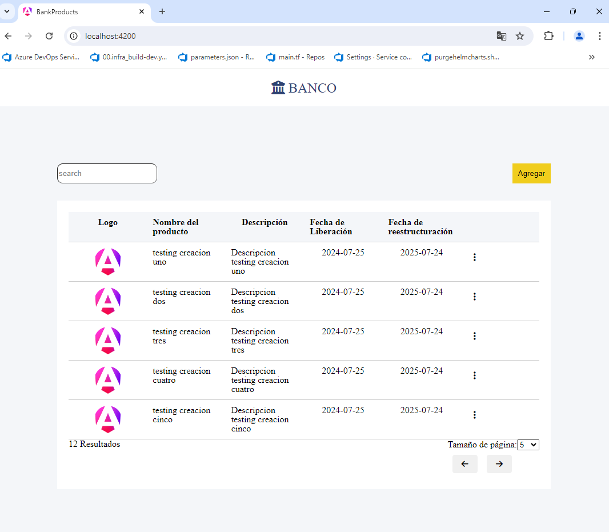

## correr los script de backend y de front end
frontend
`
cd bank-product;
npm install;
npm run start
`
backend
`
cd repo-interview-main;
npm install ;
npm run start:dev
`
## pantalla inicial 

## Creacion de archivo dump
algunos datos de prueba para poder validar la funcionalidad crear algunos productos, con postman, o usando la interfaz. ejecutar curl al endpoint http://localhost:3002/bp/products 
usando como cuerpo cada uno de los elementos del array.

`[
  {
    "id": "uno",
    "name": "testing creacion uno",
    "description": "Descripcion testing creacion uno",
    "logo": "favicon.ico",
    "date_release": "2024-07-25",
    "date_revision": "2025-07-24"
  },
  {
    "id": "dos",
    "name": "testing creacion dos",
    "description": "Descripcion testing creacion dos",
    "logo": "favicon.ico",
    "date_release": "2024-07-25",
    "date_revision": "2025-07-24"
  },
  {
    "id": "tres",
    "name": "testing creacion tres",
    "description": "Descripcion testing creacion tres",
    "logo": "favicon.ico",
    "date_release": "2024-07-25",
    "date_revision": "2025-07-24"
  },
  {
    "id": "cuatro",
    "name": "testing creacion cuatro",
    "description": "Descripcion testing creacion cuatro",
    "logo": "favicon.ico",
    "date_release": "2024-07-25",
    "date_revision": "2025-07-24"
  },
  {
    "id": "cinco",
    "name": "testing creacion cinco",
    "description": "Descripcion testing creacion cinco",
    "logo": "favicon.ico",
    "date_release": "2024-07-25",
    "date_revision": "2025-07-24"
  },
  {
    "id": "seis",
    "name": "testing creacion seis",
    "description": "Descripcion testing creacion seis",
    "logo": "favicon.ico",
    "date_release": "2024-07-25",
    "date_revision": "2025-07-24"
  },
  {
    "id": "siete",
    "name": "testing creacion siete",
    "description": "Descripcion testing creacion siete",
    "logo": "favicon.ico",
    "date_release": "2024-07-25",
    "date_revision": "2025-07-24"
  },
  {
    "id": "ocho",
    "name": "testing creacion ocho",
    "description": "Descripcion testing creacion ocho",
    "logo": "favicon.ico",
    "date_release": "2024-07-25",
    "date_revision": "2025-07-24"
  },
  {
    "id": "nueve",
    "name": "testing creacion nueve",
    "description": "Descripcion testing creacion nueve",
    "logo": "favicon.ico",
    "date_release": "2024-07-25",
    "date_revision": "2025-07-24"
  },
  {
    "id": "diez",
    "name": "testing creacion diez",
    "description": "Descripcion testing creacion diez",
    "logo": "favicon.ico",
    "date_release": "2024-07-25",
    "date_revision": "2025-07-24"
  },
  {
    "id": "once",
    "name": "testing creacion once",
    "description": "Descripcion testing creacion once",
    "logo": "favicon.ico",
    "date_release": "2024-07-25",
    "date_revision": "2025-07-24"
  }
]
` 

## pantalla despues de carga de informacion inicial

haciendo uso de barra de busqueda

funcion eliminar

funcion editar

funcion crear

funcion paginar

## unit testing en el proyecto de front end ejecutar el siguiente comando para validar el coverage

`
  cd bank-product;
  npm run test:coverage
`
se obtiene el siguiente reporte de covertura

